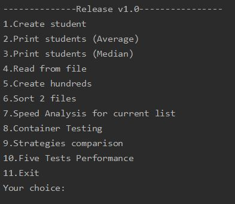

# v1.0 Final Release
Integrated development environments module
- [x] Added 2 strategies comparison 
- [x] Cleaned master branch

## About program

### How to use:
1. Clone project
2. Compile & run
> You can skip this steps and just use exe file. It's in the debug folder with sample txt file.
3. Choose option from the list by typing 1 number. Program doesn't stop if you type wrong char.


#### 1. Create student
This is a function to manually create student. System asks to type name/surname/grades/ exam grade and then calculates average and median.
Word "random" can be write in uppercase, lowercase, or even something like "RaNdOm".

#### 2 and 3. Print Student Average and Print Student Median
Prints  students average/median grades in table

#### 4. Read from file
Reads students from txt file. Systems asks to write full file path to read it. If file is in the same folder (for example debug) it's enough to write filename.txt
File **must** have this structure to be read correctly:
```
Name Surname Grade1 Grade2 Grade3 Grade4 Grade5 ExamGrade
Name1 Surname2 Grade1 Grade2 Grade3 Grade4 Grade5 ExamGrade
etc...
```

#### 5. Create hundreds
Create files with 10000, 100000, 1000000 and 10000000 randomly generated students. System writes response in console after each file is saved. The last file can take 1-2 minutes.

#### 6. Sorts 2 files
Sorts the current lists of student in 2 lists and files - ``` passed ``` and ```failed```

#### 7. Speed Analysis for the current list
Analysis of performance for the current list. Data stored in the  Measured:
- Overall time
- 2 files to create time
- Sort to files time
- File read time

#### 8. Conatiner testing
Testing by the same parameters from files "students.txt" "10000Students.txt" "100000Students.txt" and "1000000Students.txt", for each container: List, Linked List and Queue

#### 9. Strategies comparison
Comparison of the 2 strategies using file "students.txt":
- Strategy #1 is to store 2 additional lists/queue/linked lists for failed/passed students.
- Strategy #2 is to store 1 additional lists/queue/linked lists for failed students, while passed stay in the original list.

#### 10. Five tests performance
Measures by the same parameters performance of files with 10000, 100000, 1000000 and 10000000 records. If files are not generated, system  shows error message but does not stop working
 

